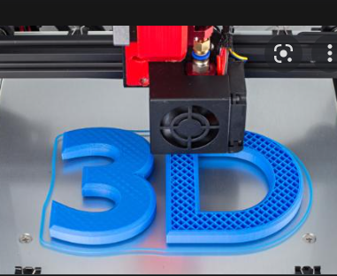

<!--
*** Thanks for checking out the Best-README-Template. If you have a suggestion
*** that would make this better, please fork the repo and create a pull request
*** or simply open an issue with the tag "enhancement".
*** Don't forget to give the project a star!
*** Thanks again! Now go create something AMAZING! :D
-->

<!-- PROJECT SHIELDS -->
<!--
*** I'm using markdown "reference style" links for readability.
*** Reference links are enclosed in brackets [ ] instead of parentheses ( ).
*** See the bottom of this document for the declaration of the reference variables
*** for contributors-url, forks-url, etc. This is an optional, concise syntax you may use.
*** https://www.markdownguide.org/basic-syntax/#reference-style-links
-->

<!-- PROJECT LOGO -->
 

  

<h3 align="center">Position feedback system and method based on FDM formula 3D printers</h3>

  

    National Patent No.CN107253326A
	  
* [Google Patent](https://patents.google.com/patent/CN107253326A/en)
	  
<!--     
    <a href="https://github.com/Dilapsky/Position_feedback_system_and_method_based_on_FDM_formula_3D_printers"><strong>Explore the docs »</strong></a>
     
     
    <a href="https://github.com/Dilapsky/Position_feedback_system_and_method_based_on_FDM_formula_3D_printers">View Demo</a>

  

<!-- ABOUT THE PROJECT -->

## Project Introduction

![Product Name Screen Shot][product-screenshot]

This research base on the open-loop controlled 3D Printers, introduce the closed-loop controlled system and continued printing after outage system into them by adding the position feedback system whose main parts are encoders, thus enhance the accuracy and stability of 3D Printers. This project mainly researches from four aspects: Reprap3D Printer, encoder, attempt of transmitting data between circuit boards, control algorithm and achievement, effects of position feedback and effects of continued printing after outage, using the methods of program logic analysis, mechanical structure analysis, transmission of signal analysis and so on, successfully achieve the position feedback system and continued printing after outage system whose main parts are encoders at last, and successfully detects and modified the step out of step motor by using this system, and solve the repeated printing problem in the continued printing problem, enhancing the accuracy and stability of 3D Printers. Comparing with the existing achievement, this position feedback system tremendously reduces the cost of feedback system, and enhances the lifetime of feedback system, thus making the close-loop controlled 3D Printers have a better market prospect.   
	 

(<a href="#top">back to top</a>)

	
## Project Background
	

In 2017, we propose the project idea and apply the Shanghai Jiao Tong University annual Innovative Practice Program(IPP). Since we made some innovative breakthrough in the project. We applied the Chinese National Invention Patent in 2017, and our national invention patent application has been authorized by the relevant national departments in 2019. About 3 years later, on Feb. 2022, our patent right has been terminated because we stopped  paying the patent maintenance fee.  
	  
On May 2022, we decide to open all the technical details of the national invention patent No.CN107253326A to public by uploading the technical files to Github.  
	  
We believe that, the disclosure of this innovative invention, will make a small contribution to the scientific research field of 3D printing and automatic control all over the world.   

(<a href="#top">back to top</a>)

### Software Built With
	

* [C++](https://www.cplusplus.com/)
* [Python](https://www.python.org/)

	
### Hardware Built With
	

* [Arduino](https://www.arduino.cc/)
* [RepRap](https://reprap.org/wiki/RepRap)

	
### Firmware Built With
	
* [Marlin](https://github.com/MarlinFirmware/Marlin)

(<a href="#top">back to top</a>)

<!-- GETTING STARTED -->
## Repo Structure

 
Repo    
| 
|--SJTU Final Thesis of university students' Innovative Practice Program(Chinese).pdf (Final University Thesis of the project) 
| 
|--SJTU Final Defense of university students' Innovative Practice Program(English).pdf (Final University Presentation of the project) 
| 
|--Sample_Movie_during_trail.mp4 (A video shown the operation of the project, during trail stage) 
| 
|--Patent_Right_Termination_information(Chinese).pdf (Proof of Patent Right Termination) 
| 
|--marlin_main_complete (Code folder) 
| 
|--3D_models_and_Pictures (Folders of 3D models and Pictures) 
| 
|--images (Folder of Readme images) 
| 
|--README.md (Readme file) 
| 
|--LICENSE (License File) 

	
## Subfolder Structure

 
3D_models_and_Pictures 
	| 
	|--3D_models_by_Siemens-NX (Folders of 3D models that build from Siemens-NX) 
                      | 
					  |--Parts_Drawing (Pictures that show the parts) 
					  | 
					  |--Assembly_Drawing (Pictures that show the assemble process of the parts) 
					  | 
					  |--Real_Photos (Photos of the Actual Machine) 

<!-- LICENSE -->
	
## License

Distributed under the MIT License. See `LICENSE` for more information.

(<a href="#top">back to top</a>)

<!-- CONTACT -->
	
## Contact

If any concerns, you can contact Dilapsky Xiahan LI: Dilapsky@gmail.com

* [Linkedin](https://www.linkedin.com/in/xiahan-li-913423154/)

(<a href="#top">back to top</a>)

<!-- ACKNOWLEDGMENTS -->
## Acknowledgments

We would like to thank University of Michigan-Shanghai Jiao Tong University Joint Institute(UMJI) for providing us with funds, and thank Mr. Jinsong Li from the Engineering Training Center for providing us with venues and equipment during the implementation of our project. Thanks to Yao Yue, Li Chunchao from UMJI, and Yu Xinsheng from the School of Materials Science, who helped us debug equipment, write codes, and provide ideas and technical support during the implementation of our project. We would like to thank Mr. Wang Yuli from Shanghai Jiaoda Patent Office for revising documents and acting as an agent for our patent application.

(<a href="#top">back to top</a>)

<!-- MARKDOWN LINKS & IMAGES -->
<!-- https://www.markdownguide.org/basic-syntax/#reference-style-links -->
[product-screenshot]: images/screenshot.jpg
